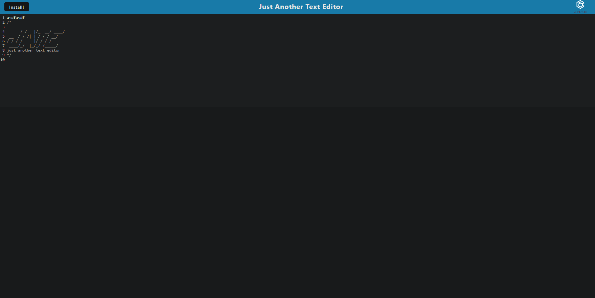

# Just-Another-Text-Editor

## Description

This is a simple web application that allows clients to code on their browser and have their text automatically saved and reloaded when they leave the page. In addition, this application also allows installation on devices so that users can utilize the text editor offline. 

## [Try it yourself!](https://fast-harbor-57378.herokuapp.com/)

  

## Installation

### [Github Repo](https://github.com/chrismuto/pwa-text-editor)
This web application requires the user to install NodeJS for functionality of the required npm packages. The user will also need to install the npm packages listed in the technology section. The package.json files within the root, client, and server directories have already been preset to install all necessary packages on the command "npm install" within the terminal. All listed packages will link to their resources.

## Usage

This application can be run at http://localhost:3000 or by installing it on a local mobile device or computer.

## Technology

- [NodeJS](https://nodejs.org/en/) 
- [IDB](https://www.npmjs.com/package/idb) 
- [Express](https://expressjs.com/) 
- [Babel](https://babeljs.io/) 
- [Webpack](https://webpack.js.org/) 
- [Workbox](https://developers.google.com/web/tools/workbox) 
- [Code Mirror](https://codemirror.net/)

## Credits

I want to thank the following developers for providing feedback and review during the development of this application:  
- Github: [Marco Flores](https://github.com/JaggedComet/)
- Github: [David Luu](https://github.com/MaestroLuu)